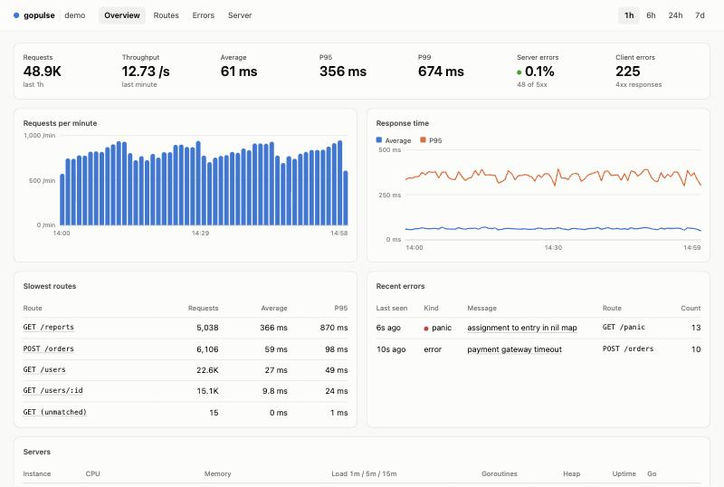
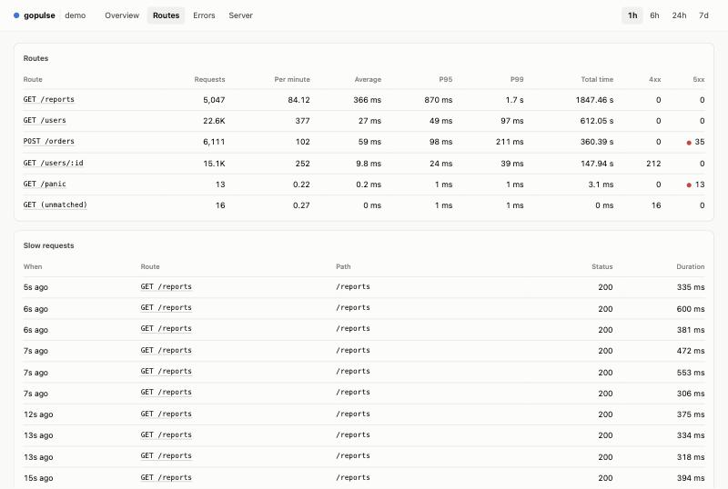
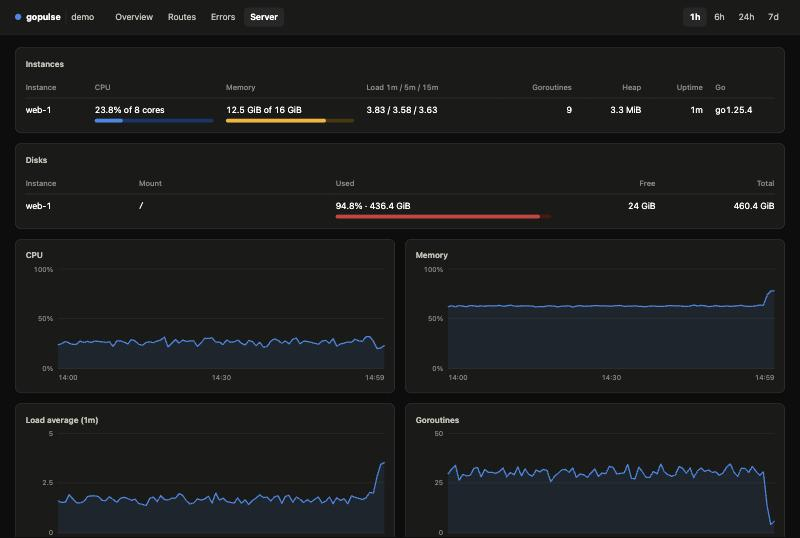

# gopulse

[](https://github.com/nicklasos/gopulse/actions/workflows/test.yml)
[](https://pkg.go.dev/github.com/nicklasos/gopulse)
[](https://goreportcard.com/report/github.com/nicklasos/gopulse)
[](LICENSE)

A monitoring dashboard that lives inside your Go web service, in the spirit of
Laravel Pulse. Add one middleware and get a password-protected page showing
request rates, response times per route, errors, panics and server capacity.
No agent, no separate service, no JavaScript build.



## Features

- **Requests** — count, throughput, average, P95 and P99 per route template (`/users/:id`, not `/users/42`), with 4xx and 5xx counts.
- **Slow requests** — individual requests above a threshold you choose.
- **Errors and panics** — grouped by fingerprint, with count, first and last sighting, and the stack for panics.
- **Server** — CPU, memory, load, disk capacity per mount, goroutines and heap, per instance.
- **Custom pages** — add your own tabs built from stats, tables, charts and key-value lists, or raw HTML.
- **Custom metrics** — one call to record a business number; chart it on your own page.
- **Safe on the hot path** — events go through a bounded queue and are aggregated in the background. If the queue is full, events are dropped and counted; requests never wait.
- **Light and dark** — follows the browser setting.

| Routes | Server (dark) |
|---|---|
|  |  |

## Status

Early. The API may still change before `v1.0.0`.

| Area | State |
|---|---|
| Gin adapter, `net/http` middleware | Available |
| Requests, errors, panics, host statistics | Available |
| Custom pages and metrics | Available |
| In-memory store | Available |
| Redis store (history across restarts, several instances) | Planned |
| Slow SQL queries (pgx) and recent logs (`slog`) | Planned |

## Install

```bash
go get github.com/nicklasos/gopulse
```

Requires Go 1.23 or newer.

## Quick start with Gin

```go
package main

import (
	"github.com/gin-gonic/gin"

	pulse "github.com/nicklasos/gopulse"
	"github.com/nicklasos/gopulse/pulsegin"
)

func main() {
	p := pulse.New(pulse.Config{
		App:      "my-api",
		Username: "admin",
		Password: "change-me",
	})
	defer p.Close()

	r := gin.New()
	r.Use(gin.Recovery())
	r.Use(pulsegin.Middleware(p)) // after your recovery middleware
	pulsegin.Mount(r, p)          // serves the dashboard at /_pulse

	r.GET("/users/:id", func(c *gin.Context) { c.JSON(200, gin.H{"id": c.Param("id")}) })
	r.Run(":8080")
}
```

Open `http://localhost:8080/_pulse` and sign in.

Register the middleware **after** your recovery middleware. gopulse records a
panic with its stack and then re-raises it, so your own recovery still writes
the response.

## Using net/http

```go
mux := http.NewServeMux()
mux.HandleFunc("GET /users/{id}", getUser)
mux.Handle("/_pulse/", p.Handler())
mux.Handle("/_pulse", p.Handler())

http.ListenAndServe(":8080", p.Middleware(mux))
```

Routes are taken from the pattern matched by `http.ServeMux`.

## Try the demo

```bash
go run github.com/nicklasos/gopulse/examples/gin@latest
```

Then open `http://localhost:8099/_pulse` (login `admin`, password `secret`).
The demo generates its own traffic, errors and panics.

## Configuration

| Field | Default | Meaning |
|---|---|---|
| `App` | `"app"` | Service name shown in the header. |
| `Path` | `"/_pulse"` | URL prefix of the dashboard. |
| `Username`, `Password` | empty | Basic auth credentials. With an empty password the dashboard answers 404. |
| `Authorize` | none | `func(*http.Request) bool` that replaces basic auth, for example to reuse your own session. |
| `Store` | in-memory | Where data is kept. |
| `SlowRequest` | `500ms` | Requests slower than this are listed individually. |
| `FlushInterval` | `5s` | How often buffered data is written to the store. |
| `HostInterval` | `15s` | How often host statistics are sampled. A negative value turns sampling off. |
| `DiskPaths` | `["/"]` | Mount points shown on the Server page. |
| `BufferSize` | `4096` | Event queue size. |
| `MaxEntries` | `200` | Cap for each list (slow requests, error groups). |
| `Instance` | hostname | Name of this process on the Server page. |

## Custom pages

A page is a tab. A card is a panel on it. A card's `Render` function is called
on every load and returns a widget.

```go
p.AddPage("Business",
	pulse.Card{Title: "Today", Render: func(ctx context.Context, v pulse.View) (pulse.Widget, error) {
		return pulse.Stats{
			{Label: "Orders", Value: "1,284"},
			{Label: "Failed payments", Value: "3", Tone: pulse.ToneWarn},
		}, nil
	}},
	pulse.Card{Title: "Queue", Width: pulse.Half, Render: func(ctx context.Context, v pulse.View) (pulse.Widget, error) {
		return pulse.Table{
			Columns: []string{"Queue", "Waiting"},
			Rows:    [][]any{{"emails", pulse.Num("12")}, {"exports", pulse.Num("0")}},
		}, nil
	}},
)
```

Widgets:

| Widget | Use it for |
|---|---|
| `Stats` | Headline numbers, optionally with a 0–100 meter and a state colour. |
| `Table` | Rows of text, numbers, links and meters. |
| `TimeSeries` | Up to four lines over time on one axis, or columns for counts. |
| `KeyValue` | A list of labelled values. |
| `Pre` | Preformatted text. |
| `HTML` | Your own markup. It is **not** escaped, so escape anything user-supplied yourself. |

`View` carries the selected time window (`From`, `To`), the period name and
the page's query parameters.

## Custom metrics

```go
p.Record("orders", "created", order.Total)
```

Every call adds to a count and a sum for that metric and key, in the same time
buckets the built-in charts use. Read it back in a card:

```go
pulse.Card{Title: "Orders per interval", Render: func(ctx context.Context, v pulse.View) (pulse.Widget, error) {
	s, err := p.Series(ctx, "orders", "created", v.From, v.To, 60)
	if err != nil {
		return nil, err
	}
	line := pulse.Line{Name: "Orders"}
	for _, pt := range s.Points {
		line.Points = append(line.Points, pulse.Point{T: pt.Time, V: float64(pt.Count)})
	}
	return pulse.TimeSeries{Lines: []pulse.Line{line}, Bars: true}, nil
}}
```

Errors that do not fail a request can be reported with `p.Report(ctx, err)`.

## How it works

1. The middleware emits one small event per request into a buffered channel.
2. A background goroutine folds events into time buckets: 10-second buckets kept for an hour, 1-minute buckets for a day, 1-hour buckets for a week. Each bucket holds a count, a sum and a fixed histogram, which is where averages and percentiles come from.
3. Every few seconds the buckets are written to the store.
4. The dashboard is server-rendered HTML from templates embedded in the binary, refreshed every 10 seconds.

Percentiles are estimates from histogram buckets, not exact values.

## Privacy

- Only the URL path is stored for slow requests and errors. Query strings, headers, cookies and bodies are never recorded.
- Requests that match no route are grouped under `(unmatched)`, so scanners cannot fill memory with random paths.
- The dashboard's own requests are not recorded.
- Error messages are stored as your code produced them. Do not put secrets in error text.

## License

[MIT](LICENSE)
